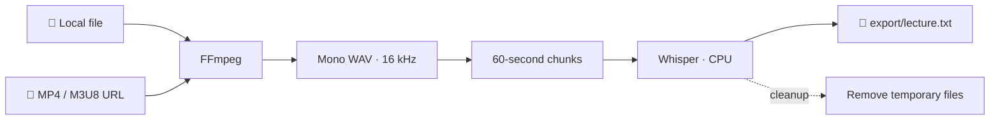

<div align="center">

# 🎙️ Course Transcriber

### Turn lecture recordings into timestamped transcripts — locally, without installing Python.

**Whisper · FFmpeg · Docker · CPU only**

[](https://www.python.org/)
[](https://docs.docker.com/compose/)
[](https://github.com/openai/whisper)
[](https://ffmpeg.org/)
[](#compatibility)
[](LICENSE)

**[Installation](#installation)** · **[Quick Start](#quick-start)** · **[Usage](#usage)** · **[Stopping](#stopping)** · **[Troubleshooting](#troubleshooting)**

</div>

---

## ✨ Overview

**Course Transcriber** is a command-line application that transcribes lectures from local audio/video files or accessible media URLs. It uses **FFmpeg** to extract and split audio, then **OpenAI Whisper** to generate a timestamped text file.

The runtime is **fully isolated in Docker**: you do not need to install Python, FFmpeg, PyTorch, or Whisper on your host computer. You can still edit the source code in VS Code.



### Features

- **Multiple input sources:** HTTP(S) MP4/M3U8 media URLs or local files (`.mp4`, `.mkv`, `.mov`, `.webm`, `.mp3`, `.wav`, and more).
- **Automatic audio segmentation:** approximately **60-second**, mono, **16 kHz** WAV chunks.
- **Language selection:** English, French, or automatic detection.
- **Model manager:** list, download on demand, and delete Whisper models from the terminal.
- **Timestamped output:** a `[HH:MM:SS]` marker at the start of each transcript block.
- **Incremental saving:** a `.partial.txt` file preserves already-transcribed chunks if processing is interrupted.
- **Automatic cleanup:** temporary audio chunks are removed; original media and downloaded models are retained.
- **CPU-based inference:** no GPU, CUDA, or Metal acceleration required.

<a id="compatibility"></a>

## 🖥️ Compatibility

| Host operating system | Architecture | Runtime |
|---|---|---|
| Windows 10/11 supported by Docker Desktop | x86-64 | Linux `amd64` container, CPU |
| macOS (Intel Mac) | x86-64 | Linux `amd64` container, CPU |
| macOS (Apple Silicon Mac) | ARM64 | Linux `arm64` container, CPU |

> [!IMPORTANT]
> This project runs **on CPU only**. Even on Apple Silicon Macs or PCs with an NVIDIA GPU, the current Docker configuration does not attempt to enable GPU acceleration. Transcription speed depends on your CPU, the selected Whisper model, and the recording length.

---

<a id="installation"></a>

## 📦 Installation

### 1. Install the host prerequisites

You only need:

| Software | Purpose | Link |
|---|---|---|
| **Docker Desktop** | Run the container | [Windows](https://docs.docker.com/desktop/setup/install/windows-install/) · [Mac](https://docs.docker.com/desktop/setup/install/mac-install/) |
| **Visual Studio Code** *(recommended)* | Edit code and use the terminal | [code.visualstudio.com](https://code.visualstudio.com/) |
| **Dev Containers** *(optional)* | Open the project directly inside its Docker environment | [VS Code extension](https://marketplace.visualstudio.com/items?itemName=ms-vscode-remote.remote-containers) |

**You do not need to install Python, FFmpeg, PyTorch, or Whisper on the host.**

<details>
<summary><strong>Windows: set up WSL 2 (if needed)</strong></summary>

Open **PowerShell as Administrator** and run:

```powershell
wsl --install
wsl --update
```

Restart Windows if prompted. Then start **Docker Desktop** using the **Linux container** engine (WSL 2 backend). See [Docker's WSL 2 documentation](https://docs.docker.com/desktop/features/wsl/).

</details>

<details>
<summary><strong>Intel or Apple Silicon Mac</strong></summary>

Install the Docker Desktop version matching your processor. Start Docker Desktop and make sure the Docker engine is running. The project's Compose file does not pin a platform, so Docker selects the architecture compatible with the host.

</details>

### 2. Get the project

Clone the public GitHub repository:

```bash
git clone https://github.com/K1000-B/course-transcriber.git
cd course-transcriber
```

Then open the `course-transcriber/` folder in **VS Code**. Run the following commands **from the project root**, where `compose.yaml` is located.

### 3. Verify Docker

In a **host terminal** (not inside the container), run:

```bash
docker --version
docker compose version
docker info
```

All three commands should succeed. If you get a connection error, start Docker Desktop first.

### 4. Build the image (first-time setup)

```bash
docker compose build
```

This command prepares Python, FFmpeg, and the transcription libraries. **It does not download Whisper speech-recognition models yet**; the application manages those separately.

> [!NOTE]
> The initial build requires an internet connection and may download several gigabytes of dependencies. Subsequent builds normally reuse Docker's cache unless the image definition or dependencies change.

### 5. Verify the dependencies

```bash
docker compose run --rm transcriber python -c "import torch, whisper; print('PyTorch:', torch.__version__); print('Device: CPU'); print('Models:', whisper.available_models())"
```

```bash
docker compose run --rm transcriber ffmpeg -version
```

If both commands succeed, the environment is ready.

---

<a id="quick-start"></a>

## 🚀 Quick Start

From the project root, launch the application:

```bash
docker compose run --rm transcriber
```

The interactive menu appears:

```text
============================================================
                     COURSE TRANSCRIBER
============================================================

1. Transcribe a course
2. Manage Whisper models
3. System information
0. Exit

>
```

**Recommended first test:** put a short video into `input/`, select `1`, then `2` for a local file. Choose the **`base`** or **`small`** model; it will be downloaded automatically if it is not already installed.

> [!TIP]
> You can also build the image and launch the app with a single command: `docker compose run --rm --build transcriber`.

<a id="usage"></a>

## 🎬 Usage

### Option A — Transcribe a local file

1. Copy a video or audio file into **`input/`** on your computer.
2. Run `docker compose run --rm transcriber`.
3. Select `1` (**Transcribe a course**), then `2` (**Local file**).
4. Select the file by its number in the displayed list.
5. Select the language and Whisper model.
6. Find your transcript in **`export/`**.

The application also discovers supported files inside subfolders of `input/`.

### Downloading a Polimi recording

Use your usual browser to sign in to Polimi and open a lecture recording you are authorized to access. When Polimi provides a download option, download the recording normally and place the resulting audio or video file in `input/`. Then use **Option A** above to select it by filename.

Course Transcriber does not automate sign-in, copy browser cookies, inspect network traffic, or bypass DRM. This keeps the application portable and makes the downloaded local-file workflow the most reliable choice.

### Option B — Transcribe an MP4 / M3U8 URL

1. Select `1` (**Transcribe a course**), then `1` (**Remote URL**).
2. Paste the **HTTP(S)** URL of an MP4 media file or M3U8 playlist.
3. Select the language and model; FFmpeg extracts the audio and Whisper transcribes it.

> [!WARNING]
> The media URL must be **accessible from inside the container**. A video player page is not necessarily a direct MP4 or M3U8 URL. Expired links, session-protected URLs, cookies, and DRM may prevent access. Only process media you are authorized to access.

### Whisper Models

From the main menu, select **`2` → Manage Whisper models**.

| Model | Relative CPU / memory demand | Suggested use |
|---|---|---|
| `tiny` | Very low | Quickly test the pipeline |
| `base` | Low | First transcription test |
| `small` | Moderate | Good starting point for lectures |
| `medium` | High | Prioritize quality when processing time allows |
| `large` / `turbo` | Very high / varies | Benchmark on your hardware and language |

The application downloads a selected model automatically if it is missing. Model files remain in **`models/`** after shutdown. You can delete downloaded models from the same menu. Some model names may share the same weight file.

### Output Format

Example: `export/Aerodynamics_Lecture_02.txt`

```text
[00:00:00] Today, we will introduce the governing equations...

[00:01:00] We can now discuss the assumptions behind the model...

[00:02:00] The next step is to consider the boundary conditions...
```

The transcript is written incrementally to a **`.partial.txt`** file. Upon successful completion, it is renamed to `.txt`. If the process is interrupted during transcription, completed segments remain available in the partial file. **Automatic resumption from that file is not implemented yet.**

---

<a id="stopping"></a>

## 🛑 Stopping the Application and Docker

Use the procedure that matches what you want to stop:

| Action | Procedure | Result |
|---|---|---|
| **Exit the application normally** | Enter `0` in the main menu | The program exits; the container launched with `--rm` is automatically removed |
| **Interrupt a transcription** | Press `Ctrl + C` in the terminal | Stops processing; already-saved transcript chunks may remain |
| **Stop the project's containers** | Run `docker compose down` in a **host terminal** | Stops and removes the project's Compose-managed containers |
| **Exit the VS Code Dev Container** | Run `Dev Containers: Reopen Folder Locally` | Reopens the project on your host computer |
| **Stop Docker entirely** | Quit Docker Desktop | Stops the Docker engine and any running containers |

```bash
# Run from the project root on the host
docker compose down
```

**The `input/`, `export/`, `models/`, and `temp/` directories remain on your computer** through the `./:/workspace` bind mount. `docker compose down` does not remove these files or the built Docker image.

> [!CAUTION]
> Avoid commands such as `docker compose down -v`, `docker system prune`, or manual deletion of volumes/directories unless you understand exactly which data will be affected. Do not delete `models/` if you want to keep your downloaded models.

---

## 🧑‍💻 Developing with VS Code Dev Containers

This workflow is **optional**. It lets you edit and run the code in VS Code while using the Python interpreter installed inside Docker.

1. Install the **Dev Containers** VS Code extension.
2. Open the project folder in VS Code.
3. Open the command palette with `Cmd + Shift + P` (Mac) or `Ctrl + Shift + P` (Windows).
4. Select **`Dev Containers: Reopen in Container`**.
5. In the **container's integrated terminal**, run:

   ```bash
   python main.py
   ```

To return to local VS Code, choose **`Dev Containers: Reopen Folder Locally`**. If necessary, you can then run `docker compose down` from a host terminal to stop the project containers.

> [!IMPORTANT]
> **Two environments, two different commands.** From a **host terminal**, run `docker compose run --rm transcriber`. From the **Dev Container terminal**, run `python main.py`. You do not need to start another container from inside the Dev Container.

## 🗂️ Project Structure

```text
course-transcriber/
├── .devcontainer/
│   └── devcontainer.json     # VS Code Dev Container settings
├── Dockerfile                # Python + FFmpeg + Whisper image
├── compose.yaml              # Docker service and bind mounts
├── requirements.txt          # Python dependencies
├── .dockerignore             # Build-context exclusions
├── main.py                   # Terminal application
├── input/                    # Local audio and video files
├── export/                   # Completed and partial transcripts
├── models/                   # Downloaded Whisper models
└── temp/                     # Temporary WAV chunks
```

**Data lifecycle:**

| Directory | Persists after exit? | Automatically cleaned? |
|---|---|---|
| `input/` | Yes | No |
| `export/` | Yes | No |
| `models/` | Yes | No |
| `temp/` | Directory retained | Yes, during normal operation and on the next start |

These paths are excluded from Git by the project's `.gitignore`, so local recordings, models, transcripts, temporary files, and secrets are not published.

## 🛠️ Maintenance

```bash
# Rebuild after changing Dockerfile or requirements.txt
docker compose build

# Rebuild and launch in one command
docker compose run --rm --build transcriber

# Show project containers
docker compose ps

# List Docker images
docker images

# Stop and remove project containers
docker compose down
```

Because `main.py` is bind-mounted from your host, **editing that file alone does not usually require rebuilding the image**. Simply restart the application.

<a id="troubleshooting"></a>

## 🧯 Troubleshooting

<details>
<summary><strong>Cannot connect to the Docker daemon</strong></summary>

Start **Docker Desktop** and verify that `docker info` works. On Windows, check that the Linux / WSL 2 backend is running.

</details>

<details>
<summary><strong>The application cannot find my local file</strong></summary>

Check that the file is inside **`input/`** (or one of its subdirectories) and that its extension is supported. A Windows path such as `C:\...` or a macOS path such as `/Users/...` is not automatically valid **inside** the container. For example, `input/lecture.mp4` on the host corresponds to `/workspace/input/lecture.mp4` in Docker.

</details>

<details>
<summary><strong>FFmpeg returns 403 / 404 / Connection failed / Invalid data</strong></summary>

First, test with a known-good local MP4. If it works, the remote URL is likely the issue: expired links, access restrictions, inaccessible playlists, browser cookies, or incomplete downloads. This application does not bypass access controls or use browser authentication. Download a permitted recording with your usual browser and transcribe it from `input/` instead.

</details>

<details>
<summary><strong>Transcription is very slow or runs out of memory</strong></summary>

Try `tiny`, `base`, or `small`; close other memory-intensive applications; and check the resources assigned to Docker Desktop. Large Whisper models may be impractical for CPU inference.

</details>

<details>
<summary><strong>A .partial.txt file remains after an interruption</strong></summary>

This is expected: the file contains all transcription output written before the interruption. It is **not resumed automatically** on the next launch. Open it in `export/` and start a full new transcription if necessary.

</details>

<details>
<summary><strong>Permission denied in input/, models/, or export/</strong></summary>

Check filesystem permissions and Docker Desktop file-sharing settings for the project directory. On Linux, files created as `root` inside a container may require permission adjustments on the host.

</details>

---

## 🔐 Data Handling and Limitations

- **Audio processing and transcription run locally:** no paid transcription API is used.
- **Downloading dependencies and models requires internet access**, as does retrieving a remote media URL when selected.
- Original media files are never deleted by the application; only temporary working files are cleaned up.
- Accuracy depends on audio quality, accents, languages, and specialized vocabulary. Verify equations, symbols, and scientific terminology against the original recording.
- Docker isolates software dependencies, **not all data**: the container has read/write access to the mounted project directory.

## 👤 Author

Created and maintained by **Camile Briard** ([@K1000-B](https://github.com/K1000-B)).

## 📄 License

This project is released under the [MIT License](LICENSE). Copyright © 2026 Camile Briard.

<div align="center">

---

**Course Transcriber** — *From lecture recordings to searchable notes.*

*Dockerized · Cross-platform · CPU-first*

</div>
